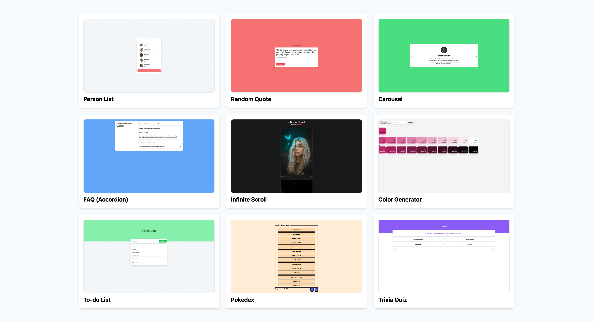

<h1 align="center"> React Mini Projects </h1>

 A collection of mini projects created using <a href="https://reactjs.org/">ReactJS</a> + <a href="https://tailwindcss.com/">TailwindCSS</a> as a reference to learn about react and its hooks. 

 

| No. | Project Name | What are being used |
| --- | ------------ | ----------------- |
| 1 | Person List | state, props, conditional rendering. |
| 2 | Random Quote | state, props, useEffect, data fetching |
| 3 | Carousel | state, props, useEffect, useMemo, useRef |
| 4 | FAQ | state, props, useEffect, useRef, useMemo, useCallback, useContext, Compounding Component Pattern |
| 5 | Infinite Scroll | state, props, useEffect, useRef, useCallback, data fetching, [IntersectionObserver API](https://developer.mozilla.org/en-US/docs/Web/API/Intersection_Observer_API) |
| 6 | Color Generator | state, props, useEffect, useCallback, forms, [values.js](https://noeldelgado.github.io/values.js/) |
| 7 | Todo List | state, props, useMemo, forms |
| 8 | Pokedex | state, props, useEffect, useCallback, data fetching, custom hooks, react portal, Compounding Component Pattern |
| 9 | TriviaQuiz | state, props, useEffect, useReducer |